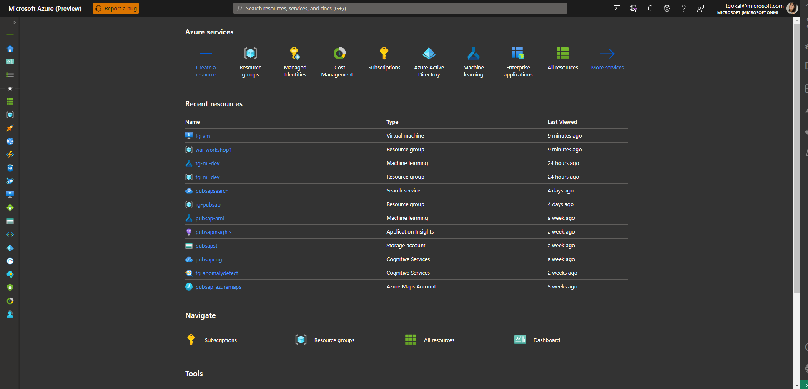

# Create a Wordpress website hosted in Azure

Let's start off with the basics and provision a resource, namely a Wordpress application that will be entirely provisioned in Azure.

1) Once you've logged into your Azure sandbox, you'll reach the Home Page of the Azure Portal. 

