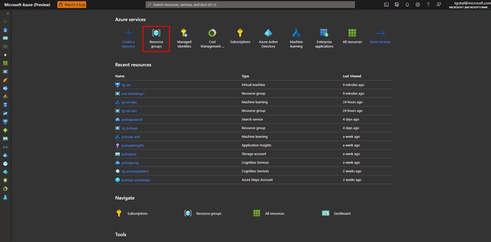

# Hands-on-Lab: Create a Wordpress website hosted in Azure

**Duration**: 10-15 minutes
## Learning Objectives
Let's start off with the basics and a complete a familiar exercise - provisioning a resource, namely a Wordpress application that will be entirely hosted in Azure. Although we also provision a SQL Database and an Azure App Service, we won't be going into any of the details of this for HOL 1, but **rather walking through the motions of creating resources using Azure Portal**.

## Our Goal 

Our goal is to provision a Wordpress Installation Azure Website that our users can use to install WordPress on their local device. We're going to achieve this by:

- Creating an Azure Resource Group
- Provisioning a Wordpress website through an Azure Web App
    - Provision an Azure Web App Service plan
    - Provision a Azure SQL Database

## Solution Architecture

## Step-By-Step Guide

1. Once you've logged into your Azure sandbox, you'll arrive at the **Home Page of the Azure Portal**. 

2. Select **Resource Groups** 

3. Select **Create** to provision a new resource group. 

4. Enter in a Resource Group name and select the region which our Azure resources will be provisioned to. The closest our Region to where we are located is often the best Region to provision our resources since it will cost less as we egress data.
    | **Resource Group Field**  | **What we Enter**  |
    |---|---|
    |  Subscription | `your_subscription`  |
    | Resource Group  | `rg-wai-intro2azure-{suffix}`  |
    |  Region |  `Australia East` |

 

Once completed, we can pass through **Validation** of our Resource Group. This checks whether our Resource Group name is globally unique and if the Region we've selected is available. 

Select **Create** to provision our Resource Group. We'll be redirected to the Resource Groups page and on the top right corner, we'll have received a notification to say that our Resource Group has been successfully created.

5. If we select our Resource Group, we can now **Create resources** by selecting the bottom blue button. 

 

By doing so, we'll be redirected to the Azure Marketplace. 

 

This is where we can provision Azure resources, like Azure Virtual Machines, Azure App Service and managed Azure SQL Databases, which is what we'll be doing later on. 

For now, we'll just provision a WordPress web application. 

6. In the Search bar of Azure Marketplace, search for '**wordpress**'. 

 

We can see a variety of different resources that create WordPress websites in various ways. 

From provisioning a VM with a WordPress image to deploying WordPress on Windows Server 2016, through to WordPress App Service, which is what we're wanting to provision today. 

  

Select the **WordPress App Service resource** and select **Create**. 

7. We now need to create our WordPress Resource by providing the below information, like the name of our WordPress application, our resource group and database. 

| **Resource Field**  | **What we Enter**  |
|---|---|
| App name  | `wordpress{suffix}` |
|  Subscription | `your_subscription`  |
| Resource Group  | `rg-wai-intro2azure-{suffix}`  |
|  Database Provider |  `Azure Database for MySQL` |
|  App Service plan | {to be created below in Step 6}  |
|  Database | {to be created below in Step 7}  |

8. We need to **Create a New App** Service Plan which will inform the features of our Wordpress application (i.e. how much memory we have, the length of time we can use our App and how much we pay for use) By default, we see the below:

Accounting for cost of the resource by geographic location and pricing tier, we want to have these values changed to be:

| **Resource Field**  | **What we Enter**  |
|---|---|
| App Service plan  | `wordpress-app{suffix}` |
|  Location | `Australia East`  |
| Pricing Tier  | `F1`  |

Select **Pricing Tier**, select **Dev/Test** and then select `F1`. We select a pricing tier and compute type to match our workload, and often how much workload we will have in the future (i.e. scalability) will influence this. 

The **Dev/Test** category is one that developers use to test their model, or application in an environment which is built for less demanding workloads. In this case, since we're just creating our application to see what it looks like, this category is the most appropriate. 

For the `F1` tier, our App will be provisioned on shared infrastructure (i.e a VM which is shared with another user in the public cloud - don't worry they can't gain access to what we're provisioning!)
Often many organisations with private and confidential data will choose to provision dedicated infrastructure and compute resources. 

With our resource however, we have the restrictions of 1GB of memory and 60 minutes/day access to the website. 

9. Next, we need to create a **Database** for our website's backend. 

A backend is can be a piece of software or the physical hardware, and in our case is a database where any users enter into our website would be stored. 

Storage is another topic which we'll be covering in greater detail later on. For example, storaging the information our users enter into our website gives us the option of creating a machine learning model to forecast revenue or product demand. The possibilities of what we can do once we've stored our data are endless. 

| **Resource Field**  | **What we Enter**  |
|---|---|
| Server name | `wordpress{suffix}-mysqldbserver` |
|  Server admin login name | `mysqldbuser`  |
| Password  | `Enter password of your choice here`  |
|  Confirm Password |  `Re-enter password of your choice here` |
| Version | `5.7`  |
|  Pricing Tier | `General Purpose, 4vCore(s), 100GB`|
|  Database name | `mysqldb_{suffix}`|

Once we select **Create**, we can see that our Deployment is in progress.

This should take 1-2 minutes and once it's provisioned, we'll see a **green tick**. 

If we select **Go to resource**, we get redirected to the App homepage.

As we've spun up our App, we've also create our SQL Database and as a result, we can see a peak for data being ingressed and egressed in our **Data In** and **Data Out** charts.

10. Finally, we test out our App by copying and pasting the URL from the Overview section into a New Tab in our Browser and press **Enter**. 

Congratulations! 🥳 🎊 👏🏽

You've successfully completed this lab by walking through the motions of provisioning Azure resources - an Azure Web App hosting a Wordpress website and a managed Azure SQL Database.