# Hands-on-Lab 2: Provision an Azure VM from Azure Cloud Shell

**Duration**: 10 minutes

## **Learning Objectives**
- Understand what a virtual machine is in Azure.
- Understand SSH and generate a keygen-pair for secure access into our virtual network and virtual machine.
- Provision a resource group, virtual network and VM from the Azure Cloud Shell.
- SSH into a VM and install NGINX.
- Explain what a virtual networks and virtual machines are.

## **Our Goal and Background**

Our goal is to provision a Linux virtual machine (VM) in Azure with PowerShell using Azure Cloud Shell. 

Think of a VM as a server - or computer - that exists just like your PC or laptop, but only now it's completely managed by Microsoft in an Azure Datacenter, located in an Azure Region. Microsoft has 42 Azure Regions, more than any cloud provider, and we've even created an [underwater data center](https://news.microsoft.com/innovation-stories/project-natick-underwater-datacenter/)! 

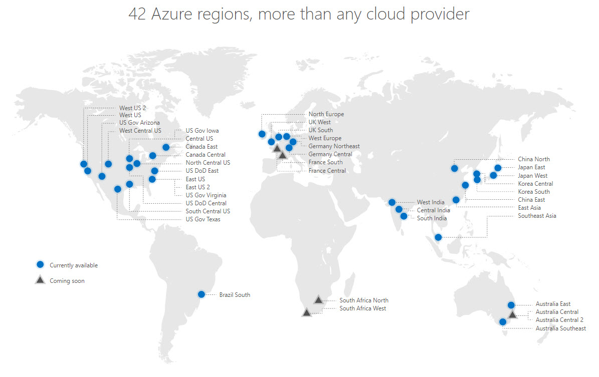

Virtual machines are like any computer you would have worked with before, or like the one you're using now; they need software and hardware to work. In our case, we're provisioning a Linux virtual machine.

Linux is a type of operating system (OS). You've heard of Windows and Mac - these are operating systems created by Microsoft and Apple respectively and are unique and main product differentiators. Other popular operating systems you would have heard of or used are Android and Linux. 

Operating systems are kind of a big deal - it's **the most important piece of software that runs on a computer**. Why? Because it controls and manages a computer's memory and processes (i.e. how many files and photos you can save on your laptop and how quick it runs). So, every time Microsoft or Apple releases a new operating system, like [Windows 11](https://www.microsoft.com/en-au/windows/windows-11) or [macOS Monterey](https://www.apple.com/au/macos/monterey-preview/), software engineers and hardware engineers have developed a new way of optimizing a computer's processes. Think of the operating system as the **connective tissue between the hardware components and the software that we run on a computer** (i.e. apps like Word, Excel, PowerPoint, Pages, Safari, etc.). Without us knowing how to speak a computer's language, we're able to communicate to the computer's hardware all because of an operating system, like Windows 11 or macOS Monterey.

Whenever we use a computer, we're using it's software, but we also know that a computer is so much more than just it's software. A computer comprises of a central processing unit (CPU), graphics card, sound card, motherboard and random access memory (RAM), to name a few. These are the physical bits and bobs that computer engineers design for efficient computations. 

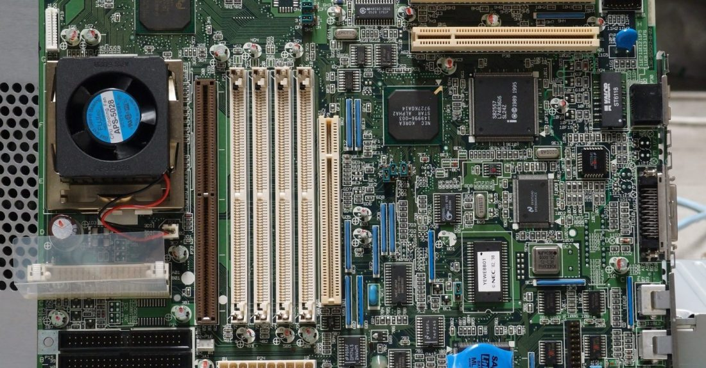

Whenever we buy a computer, the hardware components, like CPU and RAM are fixed into place - what we see is what we get. That's all good for our university assignments or Excel spreadsheets, but when big organisations are managing websites and apps where the number of users could increase or decrease, it would be incredibly beneficial to lever with these fixed components. 

Enter Microsoft Azure! With only a couple of clicks, we can use a computer - or virtual machine - with a different amount of RAM or a different type of processing unit. That's the power (and not to mention cost effectiveness) of Azure - a user or organisation can scale the number of fixed hardware components (i.e. RAM, CPU vcores) depending on workload, online traffic and amount of data being collected. 

Think about Christmas or Black Friday - the demand for online shopping is massive! Online stores like eBay, Myers, Apple, H&M, Lululemon and Uniqlo for example, can scale their virtual machines up and down to support website demand all because they're hosted in the Cloud, and avoid receiving tweets like these...

When we're in Azure we know we can scale the hardware components. But can we do that for the software components? Absolutely! In fact, we can do this by specifying something called an **image**. An image describes the type of operating system (OS) used and it's version for a virtual machine. 

In our case, we're using the Ubuntu 18.04 LTS image from Canonical through Azure Marketplace. Ubuntu is a child distribution of Linux, as you can see below. 

It originated from the Linux operating system. Canonical is the commercial sponsor of Ubuntu and since we're using their service - the Ubuntu 18.04 image - they receive a share of the profit. Azure Marketplace is how companies and organisations can make a profit by selling their own service/product/IP which is hosted on Microsoft Azure.

To see our VM in action, you'll also SSH to the VM and install the NGINX web server. Secure Shell Protocol (SSH) is a cryptographic network protocol for operating network services over an unsecured network. In a nutshell, think of SSH as a sturdy bridge which allows us to access our VM only by providing a secure and well-defined route over the network. NGINX (pronounced "engine-x") is a web server or program that uses HTTP (Hypertext Transfer Protocol) to connect us to the Internet and see a website.

## **Solution Architecture**

## **Step-By-Step Guide**

### **Log into Azure Sandbox**

Once you've logged into your Azure sandbox, you'll arrive at the **Home Page of the Azure Portal**. 

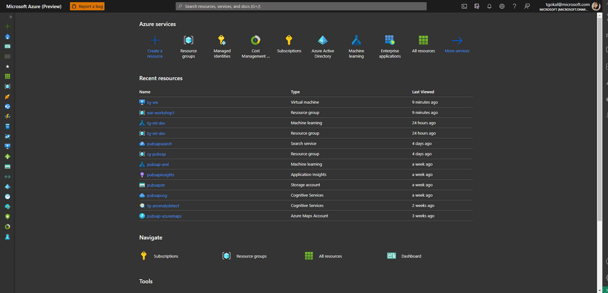

### **Open Azure Cloud Shell**

Select **Azure Cloud Shell** on the top right corner. Azure Cloud Shell is an interactive, authenticated, browser-accessible shell for managing Azure resources. It provides the flexibility of choosing the shell experience that best suits the way you work, either Bash or PowerShell. 

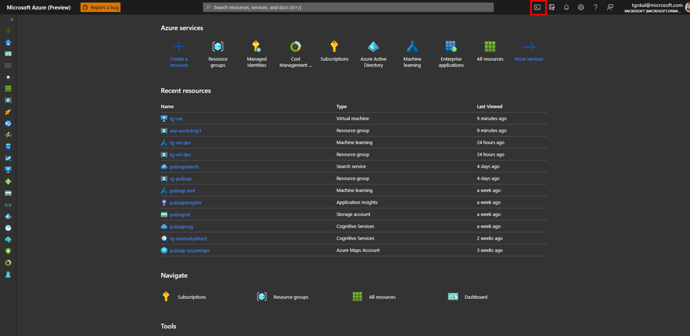

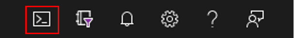

Selecting the Cloud Shell will open up PowerShell by default at the bottom of our Azure Portal. The Azure PowerShell module is used to create and manage Azure resources from the PowerShell command line. Mac OS and Linux OS uses BASH as the scripting language, whilst Windows uses PowerShell as the default scripting language.

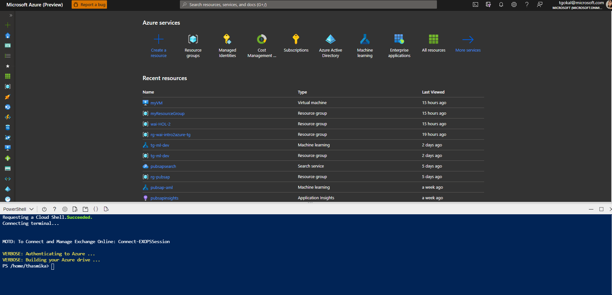

### **Create a SSH key pair**

Next, we need to create a [SSH key pair](https://www.ssh.com/academy/ssh/keygen) using `ssh-keygen`. 

`ssh-keygen` is a tool for creating new authentication key pairs for SSH. Think of it like creating a password for your email or Messenger. By creating a key pair, we can automatically login and authenticate our identity. This prevents someone who isn't us from trying to access our VM. 

We create a cryptographic key pair by executing the following line in the Cloud Shell: `ssh-keygen -t rsa -b 4096`. 

- `ssh-keygen` is the command that we use to create our key pair.
- `-t` lets us specify which cryptographic algorithm we implement on the generation of our key pair
- `rsa` is an old cryptographic algorithm which we'll be using
- `-b` lets us specify the size of our key
- `4096` is the amount of bits used for key size. The larger the key size, the hard it is for a hacker to gain access to our VM.

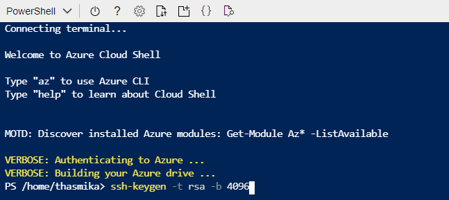

Next, we'll be prompted to provide a filename for the keypair. This is optional, and we can hit **Enter** to use the default location of `/home/<username>/.ssh/id_rsa`.

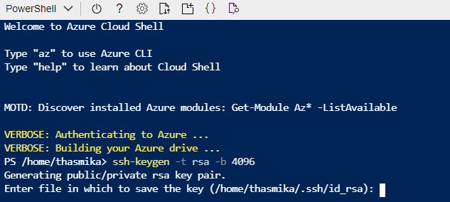

Enter in a passphrase. Remember what you enter here because you'll be prompted to use this passphrase later as we provision the VM. **For security reasons, you won't see anything appear as you enter a passphrase. Don't worry, you have typed your passphrase, it's there, you just can't see it. Keep it simple.**

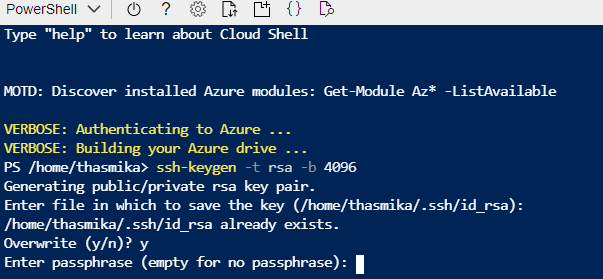

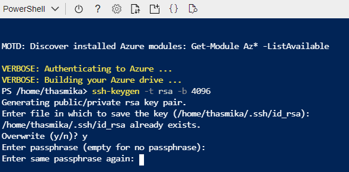

Your identification will be saved and you'll be provided witha key fingerprint and randomart image. 

### **Create a Resource Group**

Create a resource group by using the command `New-AzResourceGroup -Name "myResourceGroup" -Location "EastUS"`. 

We're choosing to keep the resource group in EastUS because there are restrictions in provisioning a VM and virtual network in this exercise within Australia. We wouldn't normally do this but for this short dev/test exercise, it will be inexpensive. 

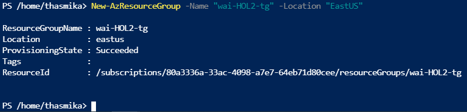

### **Create a Virtual Network**

Create a virtual network and related resources. These resources will allow our VM to connect to the Internet. 

- First we define a **subnet** which divides  our network into a smaller network with an address. It helps us set virtual boundaries within our network. We give our subnet a name `mySubnet` and an private IP address `192.168.1.0/24`:

    -  `$subnetConfig = New-AzVirtualNetworkSubnetConfig -Name "mySubnet" -AddressPrefix 192.168.1.0/24`

    

- Next, we define our **virtual network**, which connects our VM to the Internet. We define it in our `myResourceGroup` and call our `$subnetConfig`:

    - `$vnet = New-AzVirtualNetwork -ResourceGroupName "myResourceGroup" -Location "EastUS" -Name "myVNET" -AddressPrefix 192.168.0.0/16 -Subnet $subnetConfig`

    

- We define our public IP address which makes our VM discoverable on the Internet. Again, we define this in our `myResourceGroup`:

    - `$pip = New-AzPublicIpAddress -ResourceGroupName "myResourceGroup" -Location "EastUS" -AllocationMethod Static -IdleTimeoutInMinutes 4 -Name "mypublicdns$(Get-Random)"`

    

- Next, we create a network security group for SSH `nsgRuleSSH`. A network security group secures our virtual machine as we connect it to the Internet. This particular rule secures it for port 22 - this means that we can SSH into our virtual machine:

    -  `$nsgRuleSSH = New-AzNetworkSecurityRuleConfig -Name "myNetworkSecurityGroupRuleSSH" -Protocol "Tcp" -Direction "Inbound" -Priority 1000 -SourceAddressPrefix * -SourcePortRange * -DestinationAddressPrefix * -DestinationPortRange 22 -Access "Allow"`

    

- We repeat this again but for port 88 - this means that allow incoming web traffic from the Internet, `nsgRuleWeb`:

    - `$nsgRuleWeb = New-AzNetworkSecurityRuleConfig -Name "myNetworkSecurityGroupRuleWWW" -Protocol "Tcp" -Direction "Inbound" -Priority 1001 -SourceAddressPrefix * -SourcePortRange * -DestinationAddressPrefix * -DestinationPortRange 80 -Access "Allow"`

    

- We compile our two NSG rules:

    - `$nsg = New-AzNetworkSecurityGroup -ResourceGroupName "myResourceGroup" -Location "EastUS" -Name "myNetworkSecurityGroup" -SecurityRules $nsgRuleSSH,$nsgRuleWeb`

    

- Finally, we create our virtual network by calling our subnet, 2 NSG rules and public IP address:

    - `$nic = New-AzNetworkInterface -Name "myNic" -ResourceGroupName "myResourceGroup" -Location "EastUS" -SubnetId $vnet.Subnets[0].Id -PublicIpAddressId $pip.Id -NetworkSecurityGroupId $nsg.Id`

    

- We can see our virtual network has been provisioned in Azure.

### **Create a Virtual Machine**

Next, we can create our virtual machine using PowerShell. 

- First, we define a credential object, by defining a secure password, where we enter in our SSH passphrase from earlier.
    -  `$securePassword = ConvertTo-SecureString '{SSH passphrase}' -AsPlainText -Force`
    
    

    -  `$cred = New-Object System.Management.Automation.PSCredential ("{your_name}", $securePassword)`

    

- Next, we define our virtual machine configuration:
    - `$vmConfig = New-AzVMConfig -VMName "myVM" -VMSize "Standard_D1_v2" | Set-AzVMOperatingSystem -Linux -ComputerName "myVM" -Credential $cred -DisablePasswordAuthentication | Set-AzVMSourceImage -PublisherName "Canonical" -Offer "UbuntuServer" -Skus "18.04-LTS" -Version "latest" | Add-AzVMNetworkInterface -Id $nic.Id`

    

- We configure our SSH key:
    - `$sshPublicKey = cat ~/.ssh/id_rsa.pub`
    - `Add-AzVMSshPublicKey -VM $vmconfig -KeyData $sshPublicKey -Path "/home/azureuser/.ssh/authorized_keys"`

    

- We provision our VM with one final command:
    - `New-AzVM -ResourceGroupName "myResourceGroup" -Location eastus -VM $vmConfig`

    

    - Deployment will take a few minutes, but once it's completed, you'll receive a 200 status code, meaning that deployment is successful and can be seen in the Portal.

    
    

### **Connect to VM**

Now, we need to connect to the VM by getting the public IP address using the following command: 

- `Get-AzPublicIpAddress -ResourceGroupName "myResourceGroup" | Select "IpAddress"` This address makes our VM discoverable on the Internet.
    

- In the command line, we execute the next command which creates a SSH session, allowing us secure access to our VM. 
    - `ssh azureuser@{ip_address_from_previous_step}`
    - You'll be prompted if you want to continue connecting during the session. Enter `yes`.
    - Next, enter in your SSH passphrase from earlier.
    - We can see the Cloud Shell change and the command line is now running from the virtual machine that we created.

    

### **Install NGINX**

Next, we need to install NGINX on our VM using the following commands. Here we're installing additional software or packages - this is very common in software development.

- `sudo apt-get -y update`

- `sudo apt-get -y install nginx`

- Once that's been installed, we can type `exit` to leave the SSH session. 

### **View our VM in action**

To view our VM in action, we can copy and paste our public IP address found in Azure Portal for our VM into a new Browser tab. 

## Congratulations! 🎊✨🔥 

You've successfully provisioned a virtual machine from the command line using PowerShell, created a virtual network with a subnet, IP address and network security rules AND SSH'd into the VM. Way to go!

### **Delete Resource Group**

As best practice, we always delete resources once we've finished using them, by running the following command:

