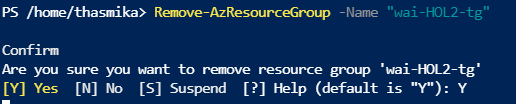
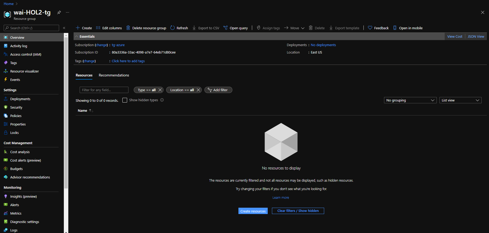

# Hands-on-Lab 3: Provision and query an Azure SQL Database

**Duration**: 10-15 minutes

## Table of Contents
- [Learning Objectives](https://github.com/tgokal/wai21-workshop1/blob/master/HOL/labs/HOL%202%20Provision%20Azure%20VM%20from%20Azure%20Cloud%20Shell.md#learning-objectives)
- [Our Goal and Background](https://github.com/tgokal/wai21-workshop1/blob/master/HOL/labs/HOL%202%20Provision%20Azure%20VM%20from%20Azure%20Cloud%20Shell.md#our-goal-and-background)
- [Solution Architecture](https://github.com/tgokal/wai21-workshop1/blob/master/HOL/labs/HOL%202%20Provision%20Azure%20VM%20from%20Azure%20Cloud%20Shell.md#solution-architecture)
- [Step-By-Step Guide](https://github.com/tgokal/wai21-workshop1/blob/master/HOL/labs/HOL%202%20Provision%20Azure%20VM%20from%20Azure%20Cloud%20Shell.md#step-by-step-guide)
    - [Log into Azure Sandbox](https://github.com/tgokal/wai21-workshop1/blob/master/HOL/labs/HOL%202%20Provision%20Azure%20VM%20from%20Azure%20Cloud%20Shell.md#log-into-azure-sandbox)
    - [Create a Database Resource](https://github.com/tgokal/wai21-workshop1/blob/master/HOL/labs/HOL%202%20Provision%20Azure%20VM%20from%20Azure%20Cloud%20Shell.md#open-azure-cloud-shell)
    - [Create a new Database Server](https://github.com/tgokal/wai21-workshop1/blob/master/HOL/labs/HOL%202%20Provision%20Azure%20VM%20from%20Azure%20Cloud%20Shell.md#create-a-ssh-key-pair)
    - [Configure Networking](https://github.com/tgokal/wai21-workshop1/blob/master/HOL/labs/HOL%202%20Provision%20Azure%20VM%20from%20Azure%20Cloud%20Shell.md#create-a-resource-group)
    - [Configure Security](https://github.com/tgokal/wai21-workshop1/blob/master/HOL/labs/HOL%202%20Provision%20Azure%20VM%20from%20Azure%20Cloud%20Shell.md#create-a-virtual-network)
    - [Configure Data source and sever firewall](https://github.com/tgokal/wai21-workshop1/blob/master/HOL/labs/HOL%202%20Provision%20Azure%20VM%20from%20Azure%20Cloud%20Shell.md#create-a-virtual-machine)
    - [Confirm Database creation](https://github.com/tgokal/wai21-workshop1/blob/master/HOL/labs/HOL%202%20Provision%20Azure%20VM%20from%20Azure%20Cloud%20Shell.md#connect-to-vm)
    - [Test Database by using Query Editor (preview)](https://github.com/tgokal/wai21-workshop1/blob/master/HOL/labs/HOL%202%20Provision%20Azure%20VM%20from%20Azure%20Cloud%20Shell.md#install-nginx)
    - [Add Client IP Address](https://github.com/tgokal/wai21-workshop1/blob/master/HOL/labs/HOL%202%20Provision%20Azure%20VM%20from%20Azure%20Cloud%20Shell.md#view-our-vm-in-action)
    - [Execute Query](https://github.com/tgokal/wai21-workshop1/blob/master/HOL/labs/HOL%202%20Provision%20Azure%20VM%20from%20Azure%20Cloud%20Shell.md#view-our-vm-in-action)
- [Congratulations!](https://github.com/tgokal/wai21-workshop1/blob/master/HOL/labs/HOL%202%20Provision%20Azure%20VM%20from%20Azure%20Cloud%20Shell.md#congratulations-)
- [Delete Resource Group](https://github.com/tgokal/wai21-workshop1/blob/master/HOL/labs/HOL%202%20Provision%20Azure%20VM%20from%20Azure%20Cloud%20Shell.md#delete-resource-group)

## Learning Objectives
Many organisations use SQL Databases for part of their lift-and-shift data migrations. We're going to walk through the motions of provisioning a SQL Database

## Our Goal 

Our goal is to provision a SQL Database in Azure and then query the data in that database.

## Solution Architecture

https://docs.microsoft.com/en-us/learn/modules/azure-database-fundamentals/exercise-create-sql-database?ns-enrollment-type=LearningPath&ns-enrollment-id=learn.az-900-describe-core-azure-services

## Step-By-Step Guide

hello111_

## Congratulations! 🎊✨🔥 

You've successfully provisioned a virtual machine from the command line using PowerShell, created a virtual network with a subnet, IP address and network security rules AND SSH'd into the VM. Way to go!

### **Delete Resource Group**

As best practice, we always delete resources once we've finished using them, by running the following command:

