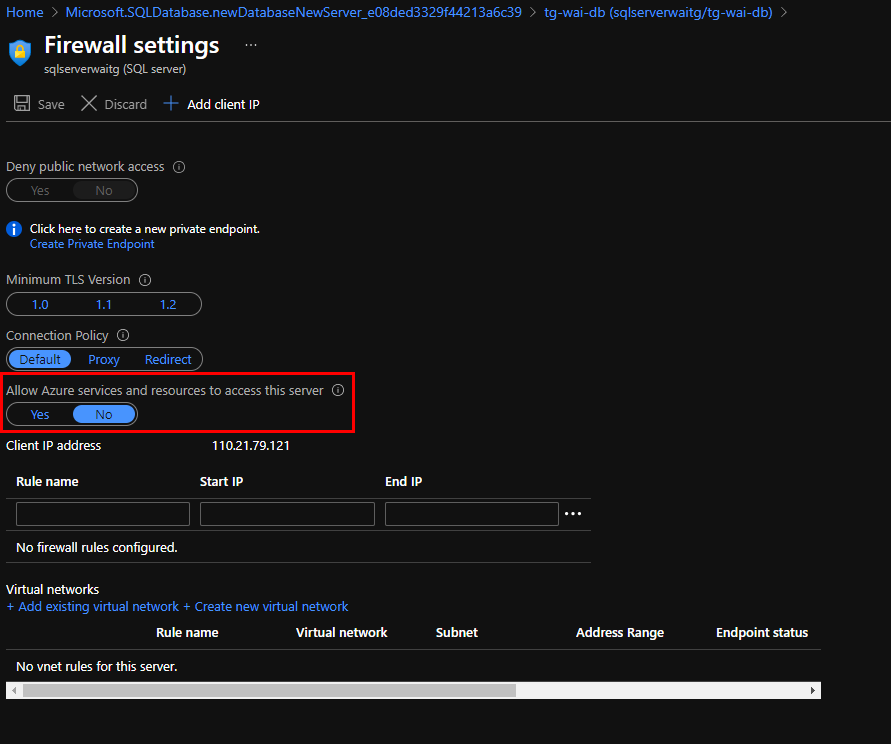

# Hands-on-Lab 3: Provision and query an Azure SQL Database

**Duration**: 10-15 minutes

## Table of Contents
- [Learning Objectives](https://github.com/tgokal/wai21-workshop1/blob/master/HOL/labs/HOL%203%20Provision%20a%20managed%20Azure%20SQL%20Database.md#learning-objectives)
- [Our Goal and Background](https://github.com/tgokal/wai21-workshop1/blob/master/HOL/labs/HOL%203%20Provision%20a%20managed%20Azure%20SQL%20Database.md#our-goal-and-background)
- [Step-By-Step Guide](https://github.com/tgokal/wai21-workshop1/blob/master/HOL/labs/HOL%203%20Provision%20a%20managed%20Azure%20SQL%20Database.md#step-by-step-guide)
    - [Log into Azure Sandbox](https://github.com/tgokal/wai21-workshop1/blob/master/HOL/labs/HOL%203%20Provision%20a%20managed%20Azure%20SQL%20Database.md#log-into-azure-sandbox)
    - [Create a Database Resource](https://github.com/tgokal/wai21-workshop1/blob/master/HOL/labs/HOL%203%20Provision%20a%20managed%20Azure%20SQL%20Database.md#create-a-database-resource)
    - [Create a new Database Server](https://github.com/tgokal/wai21-workshop1/blob/master/HOL/labs/HOL%203%20Provision%20a%20managed%20Azure%20SQL%20Database.md#create-a-new-database-server)
    - [Configure Networking](https://github.com/tgokal/wai21-workshop1/blob/master/HOL/labs/HOL%203%20Provision%20a%20managed%20Azure%20SQL%20Database.md#configure-networking)
    - [Configure Security](https://github.com/tgokal/wai21-workshop1/blob/master/HOL/labs/HOL%203%20Provision%20a%20managed%20Azure%20SQL%20Database.md#configure-security)
    - [Configure Data source and sever firewall](https://github.com/tgokal/wai21-workshop1/blob/master/HOL/labs/HOL%203%20Provision%20a%20managed%20Azure%20SQL%20Database.md#configure-data-source-and-sever-firewall)
    - [Confirm Database creation](https://github.com/tgokal/wai21-workshop1/blob/master/HOL/labs/HOL%203%20Provision%20a%20managed%20Azure%20SQL%20Database.md#confirm-database-creation)
    - [Test Database by using Query Editor (preview)](https://github.com/tgokal/wai21-workshop1/blob/master/HOL/labs/HOL%203%20Provision%20a%20managed%20Azure%20SQL%20Database.md#test-database-by-using-query-editor-preview)
    - [Add Client IP Address](https://github.com/tgokal/wai21-workshop1/blob/master/HOL/labs/HOL%203%20Provision%20a%20managed%20Azure%20SQL%20Database.md#add-client-ip-address)
    - [Execute Query](https://github.com/tgokal/wai21-workshop1/blob/master/HOL/labs/HOL%203%20Provision%20a%20managed%20Azure%20SQL%20Database.md#execute-query)
- [Congratulations!](https://github.com/tgokal/wai21-workshop1/blob/master/HOL/labs/HOL%203%20Provision%20a%20managed%20Azure%20SQL%20Database.md#congratulations-)
- [Delete Resource Group](https://github.com/tgokal/wai21-workshop1/blob/master/HOL/labs/HOL%203%20Provision%20a%20managed%20Azure%20SQL%20Database.md#delete-resource-group)

## **Learning Objectives**
- Understand the importance of data storage.
- Provision a resource group, a SQL Database resource and a new database server.
- Configure firewall rules for a server.
- Learn foundational SQL commands and know how to query a database.

## **Our Goal and Background**

Many organisations use SQL Databases for part of their lift-and-shift data migrations. 
Our goal is to provision a SQL Database in Azure through the Portal and then exectue SQL commands to query the database.

Data storage is how we store data from devices and processes to be made accessible for later use. In fact, data storage has been part of our human history for a very long time. From the ancient Egyptians transcribing on papyrus scrolls to ancient India with history carved into caves and copper plates, through to punch cards in 18th century France and the age of the floppy disk and USB - data storage is part of how we collect and archive our important information. 


Microsoft has been a pioneer in the data storage space for a long time and now we've even [stored the entire Superman movie on a piece of quartz glass](https://news.microsoft.com/innovation-stories/ignite-project-silica-superman/)!

Depending on the amount of data, the type of data, the rate of ingestion of data (i.e. the rate of data flowing in from a process or device) and how this may change in future determines what type of data storage technology we use. With Azure, we have a variety of different options like:

- [Azure Storage Blobs](https://docs.microsoft.com/en-us/azure/storage/blobs/storage-blobs-introduction)
- [Azure Data Lake Store](https://docs.microsoft.com/en-us/azure/storage/blobs/data-lake-storage-introduction)
- [Azure Cosmos DB](https://docs.microsoft.com/en-us/azure/cosmos-db/)
- [Azure Data Explorer](https://docs.microsoft.com/en-us/azure/data-explorer/)

Today, we're going to be focusing on [SQL Database](https://docs.microsoft.com/en-us/azure/azure-sql/database/sql-database-paas-overview#:~:text=What%20is%20Azure%20SQL%20Database%3F%201%20Scalable%20performance,security%20and%20compliance.%20...%206%20Easy-to-use%20tools.%20) - a familiar database technology for many developers and technologists. Azure SQL Database is the cloud version of SQL, meaning that it's a fully managed PaaS database engine that handles all the management functions like upgrading, patching, backups and monitoring - all done without your involvement. It's always running the latest stable version of the SQL Server database engine and patched OS with 99.99% availability.

But what is SQL in the first place? 


Structured Query Language - or SQL - lets us access, manipulate and query a database for a specific piece of information. A SQL query is a question that you ask to your database. Think of it like a personalised bot that you see on online websites like JB Hi-Fi, Mecca Maxima and even Bunnings. But since databases don't understand a human readable language, we use SQL language to phrase our question. If any of the data in the database satisifies your query and its conditions, the query will successfully execute and you'll see a returned result which contains the data that answers your question. 

Typically, we use SQL databases for structured data like product, sales and revenue information from a business. Structured data is any data that be easily organised, clearly defined, easy to access and easy to analyse data. For example, form fields, like Name, Age, Gender, Address, Billing Info, etc. Excel Spreadsheets is another popular example of structured data. We stored structured data in relational databases, like SQL. A relational database is a data storage solution which is organised in such a way that it's structured to recognise relations between stored items of information.


## **Step-By-Step Guide**

### **Log into Azure Sandbox**

Once you've logged into your Azure sandbox, you'll arrive at the **Home Page of the Azure Portal**. 


### **Create a Database Resource**
Next, we need to create a Database Resource from Azure Marketplace. Select on **Create a resource** to be directed to the Azure Marketplace.


In the Azure Marketplace, select **Databases**.


Finally, select **Create** for **SQL Database**. 


This will redirect you to fill our information like we normally do for provisioning a resource in Azure. Databases are no different.


| **Resource Field**  | **What we Enter**  |
|---|---|
|  Subscription | `your_subscription`  |
| Resource Group  | `wai-HOL3-{suffix}`  |
|  Database name |  `wai-db-{suffix}` |
|  Server |  `Select Create New` |

### **Create a new Database Server**

By selecting to create a new database server, the New Server panel appears. Fill this information out using the table below as a guide. Our Server name must be globally unqiue, so add your initials and even 1-2 random letters at the end to ensure uniqueness. Remember the password you enter in here since you will be using this to access your database later.


| **Resource Field**  | **What we Enter**  |
|---|---|
|  Sever Name | `sqlserver-{suffix}`  |
|  Server admin login  | `sqluser`  |
|  Password |  `your_password` |
|  Location |  `Australia East` |

Select **Ok** when done. 


### **Configure Networking**

Next, select the **Next: Networking** tab at the bottom of your screen.  Here we need to ensure that we're connecting to our database server is through a public endpoint, which allows us to connect to our database from the Internet.


### **Configure Security**

Next, select the **Next: Security** tab at the bottom of your screen. Choose **Not now** to Enable Azure Defeender for SQL.


### **Configure Data source and sever firewall**
Now, we need to configure the data source that we're using. In our case, we're just using a sample dataset, **AdventureWorksLT**.


Select **Review and Create**. It will take the database approximately 2-5 minutes to deploy. 


Once it has deployed, select **Go to Resource** and select **Set server firewall**.


Set **Allow Azure services and resources to access this server** as **Yes**.




Select Save and then OK.

### **Confirm Database creation**

If we zoom out to our Resource Group, we can confirm that our database has been indeed created. 


### **Test Database by using Query Editor (preview)**

Next, we can test our database by using the Query Editor currently in preview.


We can log into the SQL database by entering in our password that we used earlier.


You should receive an error that you can't login. 


This means that our IP address - which uniquely identifies our computer - doesn't have the right access for our database through the firewall. We need to configure access correctly by addding our client IP address as rule for our firewall. This will let us access our SQL database from our computer and Azure Portal. 

### **Add Client IP Address**

Going back to **Set server firewall** and adding our client IP address to allow access.


If we re-enter our password again in the Query Editor, we should have full access to our database.


### **Execute Query**

Now we're ready to query our database using SQL!

Let's try out a basic query, where we're selecting the first 1000 rows in our Address database - this contains our customers' addresses.

```
SELECT TOP(1000) * FROM [SalesLT].[Address]
```

Here we're using the `SELECT` keyword to select our data. We specify that we want the first entries by the `TOP()` function and then include `1000` as the number of first entries to be returned in `TOP(1000)`. Next, we need to make sure that we're specifying where we're getting these first 1000 entries by using the keyword `FROM`. In our case, we're returning the `Address` field from the `SalesLT` table. The `.` between `[SalesLT]` and `[Address]` is used because we know that `[Address]` is an **attribute** in the `[SalesLT]` table.


We can see that we're returning the Residential Address, Cirty, State, Country and Postcode of our Customers. Looks like we're getting a hang of this. Let's try out another similar query, but with a different table.

```
SELECT TOP(1000) * FROM [SalesLT].[ProductDescription]
```

We can see the same query, but now we're returning Product Descriptions from the same `[SalesLT]` table. Out of observation, we can see that we can store strings just as well as integers and floats in our database.


Let's try something a bit more interesting.

```
SELECT TOP 20 pc.Name as CategoryName, p.name as ProductName
FROM SalesLT.ProductCategory pc
JOIN SalesLT.Product p
ON pc.productcategoryid = p.productcategoryid;
```

Here we `SELECT` the `TOP 20` `CategoryName` `Name` entries from an unspecified table which we're refering to as `pc` AND the `TOP 20` `ProductName` `name` entries from an unspecified table which we're refering to as `p`. Now, we specify that our `CategoryName` `Name` entries are coming `FROM` the `SalesLT.ProductCategory` table which we reference as `pc`. Next, we're applying a `JOIN` on the `SalesLT.Product` table which we reference as `p`. A `JOIN` tells us how we're aligning matching elements between the `SalesLT.ProductCategory` table and the `SalesLT.Product` table. In our case, the common element which this is occuring is `productcategoryid` for both the `SalesLT.ProductCategory` table and the `SalesLT.Product` table, or `pc.productcategoryid` and `p.productcategoryid` tables respectively.


As above, we can see that we return a list of products and their corresponding product category - all done with 4 lines of SQL!

## Congratulations! 🎊✨🔥 

You've successfully provisioned a SQL Database in Azure, configured IP address server firewall rules and then executed SQL to query our database. Amazing!

### **Delete Resource Group**

As best practice, we always delete resources once we've finished using them. This time we're deleting the resource group from the Azure Portal.


